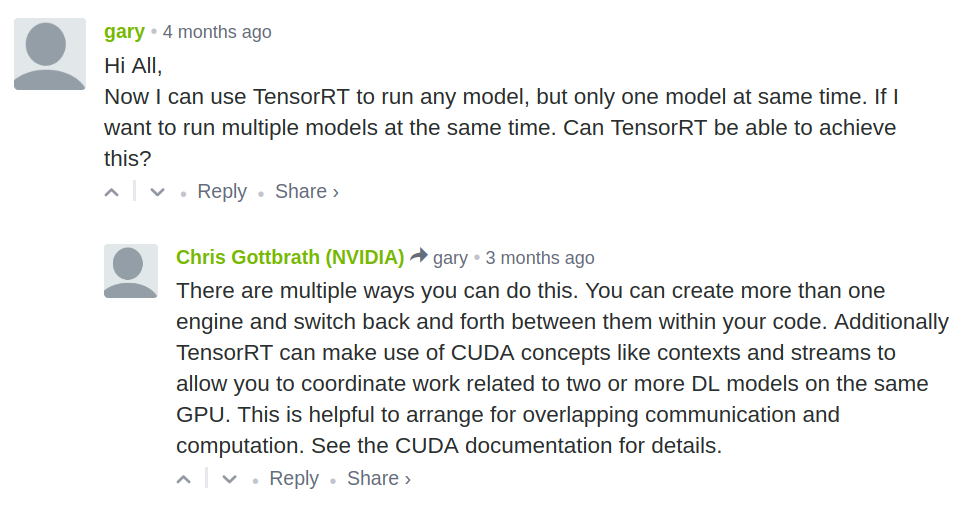
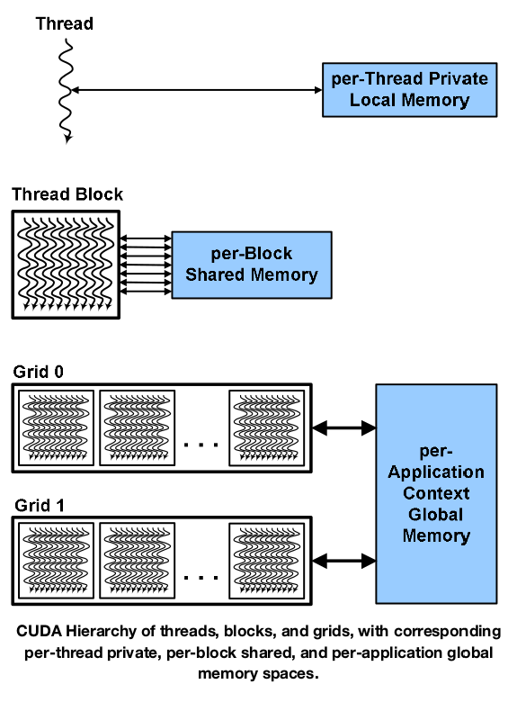
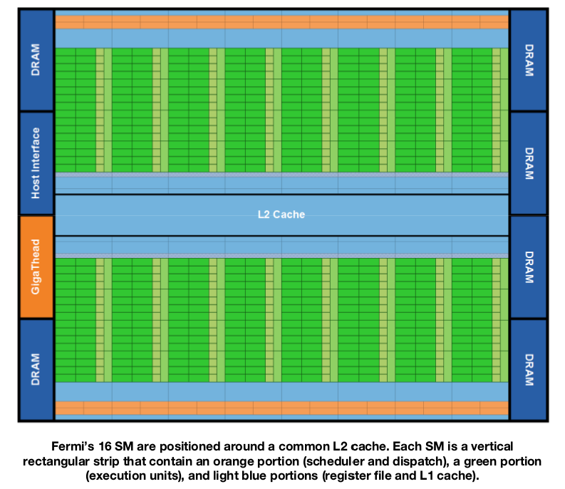
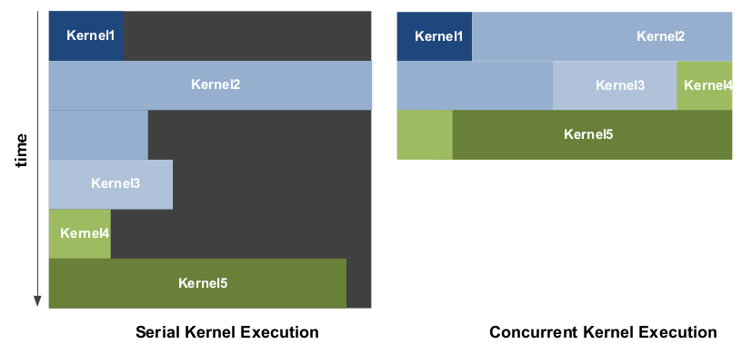

.. Below is the title of this notes.

=================================
Fundamentals of NVIDIA GPU & CUDA
=================================

:Author: Shanyun Gao

:abstract:
    This is a learning notes of NVIDIA GPU fundamentals. The study is motivated by answering the question *"can I run muptiple deep learning models on the same GPU (simultaneously), both for training and inference?"*.
    
.. meta::
    :keywords: GPU, NVIDIA, training, inference, GPU core, context, unit, warp, thread, block kernel, concurrent kernel execution
    
.. contents:: Table of Contents
.. section-numbering::

Answers from the Internet
=========================

The Question
------------

**can I CONCURRENTLY run multiple deep learning models on the same GPU?**

First Answer
------------

`answer 1 from Quora`_

In theory yes. In practice, maybe. However, even if yes, it does not provide you much benefits.

NVIDIA does not support virtualization of GPU. In order to break one GPU for several tasks running at the same time, there's two possible ways.

1. Devide the cores of GPU into muptiple groups and divide the GPU memory accordingly. Since CUDA only supports the **exclusive** usage of GPU memory, this approach is difficult. Reducing GPU memory significantly slows down the training, for GPU memory is important.

2. Time sharing, which is the way for the third party companies to virtualize GPU. Time sharing gives each running task the whole GPU memory. Their customers are usually cloud providers. Time sharing comes with a **context switch overhead cost**. Therefore it does not save you any time for running muptiple task.

Second Answer
-------------

`answer 2 from Quora`_

Possible directions: *multiple CUDA contexts*, *NVIDIA Mupti-Process Server*, *Limit each TensorFlow session's memory*

Third Answer
------------

`answer 3 from stackoverflow`_

- CUDA activity from independent host processes will create independent CUDA **contexts**, one for each process.
- CUDA activity in separate contexts will be serialized. The GPU will execute the activity from one process and when that activity is idle, it will context-switch to another context to complete the CUDA activity from other process.
- The *exception* is the **CUDA Multi-Process Server**, whose benefit is to avoid the serialization of kernels which might otherwise be able to run concurrently.
- The above conditions are in the "default" **compute mode**. GPUs in "exclusive process" or "exclusive thread" compute modes will reject any attempts to create more than one process / context on a single device.

Fourth Answer (finally...)
--------------------------

`answer 4 from tensorRT forum`_

CUDA Programming Model Basics
=============================

Term : CUDA
    CUDA stands for *Compute Unified Device Architecture*. It is a technology developed by NVIDIA that accelerates GPU computation processes. With CUDA, we can send C, C++ and Fortran code directly to the GPU without using assembly code, which lets us take advantage of **parallel computing** in which thousands of tasks / threads can be executed simultaneously.
    
.. Important:: 
    The CUDA programming model is a heterogeneous model in which both the CPU and GPU are used. 

Terminologies
-------------

Term : host
    The host refers to the CPU and its memory.
Term : device
    The device refers to the GPU and its memory.
Term : kernels
    Kernels are functions executed on the device.
    
.. admonition:: Compute Kernel defined in `WIKIPEDIA`_

    A **compute kernel** is a routine compiled for high throughput accelerators (such as GPUs), separate from but used by a main program.
    
Code run on the host can manage memory on both the host and device, and also launches kernels on the device. These kernels are executed by many GPU thread in parallel.

Sequence of Operations for CUDA C Program
-----------------------------------------

    1. Declare and allocate host and device memory.
    
    2. Initialize host data.
    
    3. Transfer data from the host to the device.
    
    4. Execute one or more kernels.
    
    5. Transfer results from the device to the host.
    
CUDA Hierarchy of Threads, Blocks etc
=====================================

Terminologies
-------------

Term : thread block
    A thread block is a set of concurrently executing threads (that can cooperate among themselves through barrier synchronization and shared memory).
Term : grid
    A grid is an array of thread blocks that execute **the same kernel**. It read inputs from global memory, write results to global memory, and synchronize between dependent kernel calls.
Term : thread
    Each thread has a per-thread private memory space used for register spills, function calls, and C automatic array variables.

How CUDA Works
--------------

    
A Short Explanation
~~~~~~~~~~~~~~~~~~~

The GPU instantiates a kernel program on a grid of parallel thread blocks. Each thread within a thread block executes an instance of the kernel. 

Several Things to Note
~~~~~~~~~~~~~~~~~~~~~~

    - Each thread within a block has a *thread ID*, *program counter*, *registers*, *per-shared private memory*, *inputs and output results*.
    
    - Each thread has a per-thread private memory space used for private memory space used for register spills, function calls, and C automatic array variables.
    
        `register spill`_: the operation of moving a variable from a register to memory.
    
    - A thread block has a *block ID* within its grid.
    
    - Each thread block has a *per-Block shared memory* space used for inter-thread communication, data sharing, and result sharing in parallel algorithms.
    
    - Grids of thread blocks share results in *Global Memory* space after kernel-wise global synchronization.
    
Hardware Execution
------------------

Term : warp
    group of 32 threads is called a warp.

**CUDA's hierachy of threads**:

    grids --> thread blocks --> threads
    
**Hierarchy of processors**:
    
    GPU --> streaming multiprocessor (SM) --> CUDA cores & other execution units
    
Sequence of Execution
~~~~~~~~~~~~~~~~~~~~~

    1. A GPU executes one or more kernel grids.
    
    2. A streaming multiprocessor executes one or more thread blocks.
    
    3. CUDA cores and other execution unites in the SM execute threads.
    
.. Note:: The SM executes threads in groups of 32 threads called a warp.

An Overview of Fermi Architecture
=================================

    - 512 CUDA cores
    - 16 SMs of 32 CUDA cores each
    - 6 64-bit memory partition, for a 384-bit memory interface
    - A host interface connects the GPU to the CPU via PCI-Express
    - The GigaThread global scheduler distributes thread blocks to SM thread schcedulers

    
    
GigaThread Thread Scheduler
---------------------------

GigaThread thread scheduler is a two-level, distributed thread scheduler. 
    
    - At the chip level, a global work distribution engine schedules thread blocks to various SMs;
    - At the SM level, each warp scheduler distributes warps of 32 threads to its execution unites.

Key Features
~~~~~~~~~~~~

1. Faster Application Context Switching

    - GPUs support multitasking through the use of context switching, where each program receives a time slice of the processor's resources. 
    - Allow developers to create applications that take greater advantage of frequent kernel-to-kernel communication.
    
2. Concurrent Kernel Execution

    - Different kernels of the **same application context** can execute on the GPU at the same time.
    - Concurrent kernel execution allows programs that execute a number of small kernels to utilize the whole GPU.
    - Kernels from different application contexts can run sequentially withi great efficiency thanks to the improved **context switching** performance.

Context
-------

A CUDA context is analogous to a `CPU process`_. 

    - All resources and actions performed within the driver API are encapsulated inside a CUDA context.
    - The system automatically cleans up these resources when the context is destroyed.

.. _`CPU process`:

CPU `Process`_
---------------

A process is an instance of a computer program that is being executed, which contains the *program code* and its *current activity*.

    - A computer program is a passive collection of instructions.
    - While a process is the actual execution of those instructions.
    - Several processes may be associated with the same program.
    
Multitasking
~~~~~~~~~~~~

Multitasking is a method to allow multiple processes to share processors and other system resources.

Time Sharing
~~~~~~~~~~~~

`Time sharing`_ is a common form of multitasking. 
    
    In time sharing, `context switches`_ are performed rapidly, which makes it seem like multiple processes are being executed simultaneously on the same processor. This seeming execution of multiple processes simultaneously is called concurrency.

Reference
=========

[1]. NVIDIA Fermi Compute Architecture Whitepaper.
[2]. CUDA C Programming Guid.

.. Links

.. _`answer 1 from Quora`: https://www.quora.com/Can-I-run-multiple-deep-learning-models-on-the-same-GPU
.. _`answer 2 from Quora`: https://www.quora.com/Can-I-run-multiple-deep-learning-models-on-the-same-GPU
.. _`answer 3 from stackoverflow`: https://stackoverflow.com/questions/31643570/running-more-than-one-cuda-applications-on-one-gpu
.. _`answer 4 from tensorRT forum`: https://devblogs.nvidia.com/parallelforall/deploying-deep-learning-nvidia-tensorrt/
.. _`WIKIPEDIA`: https://en.wikipedia.org/wiki/Compute_kernel
.. _`register spill`: https://en.wikipedia.org/wiki/Register_allocation#Spilling
.. _`Process`: https://en.wikipedia.org/wiki/Process_(computing)
.. _`Time sharing`: https://en.wikipedia.org/wiki/Time-sharing
.. _`context switches`: https://en.wikipedia.org/wiki/Context_switch
