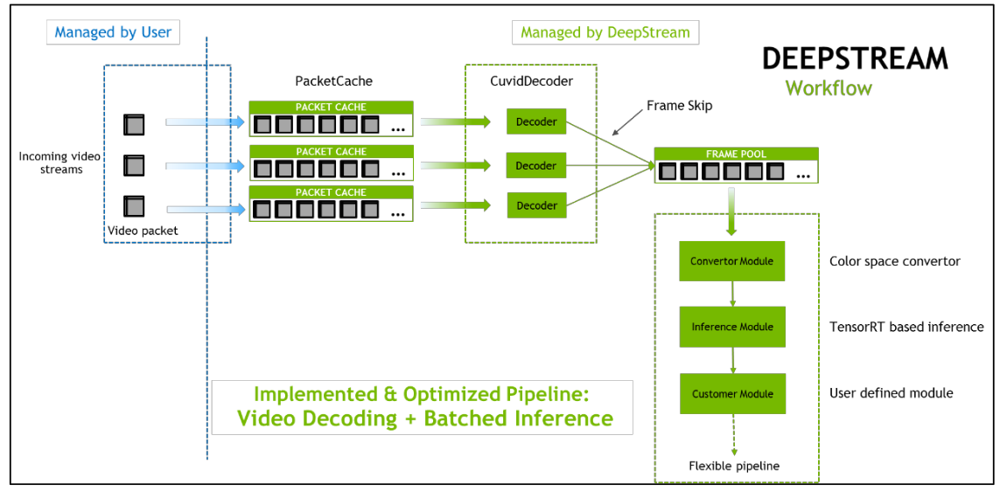

==========================
NVIDIA DeepStream Overview
==========================

:Author: Shanyun Gao

:abstract:
        This note serves as an overview of NVIDIA DeepStream SDK. The basic work flow, 
        requirements and constraints of DeepStream will be introduced.

.. meta::
        :kerwords: NVIDIA, DeepStream, Video Codec, Inference

.. contents:: Table of Contents
.. section-numbering::

Introduction
============

What Is DeepStream
------------------

DeepStream is an SDK for video content analysis. It provides flexible plug-in mechanism 
for us to incorporate custom functionality to video analytics applications.

How to Use DeepStream (In Short)
--------------------------------

- DeepStream is built on the top of `NVCODEC`_ and `NVIDIA TensorRT`_.
        
        1. NVCODEC is responsible for video decoding.

        2. TensorRT is for deep learning inference.

- DeepStream provides a high-level C++ API for GPU-accelerated video decoding and inference.

Key Features
------------

- Supports common video formats: H.264, HEVC / H.265, MPEG-2, MPEG-4, VP9, VC1.
- Takes inference with full precision float type (FP32), or optimized precision (FP16 and INT8).
- Provides flexible analytics workflow which allows users to define their inference workflow.

Workflow
========

.. Important::
        All the decoders share the **same** CUDA context (primary context) within muptiple host threads. The anslysis pipeline is in one host thread.

.. Links

.. _`NVCODEC`: https://developer.nvidia.com/nvidia-video-codec-sdk#NVDECFeatures
.. _`NVIDIA TensorRT`: https://developer.nvidia.com/tensorrt
