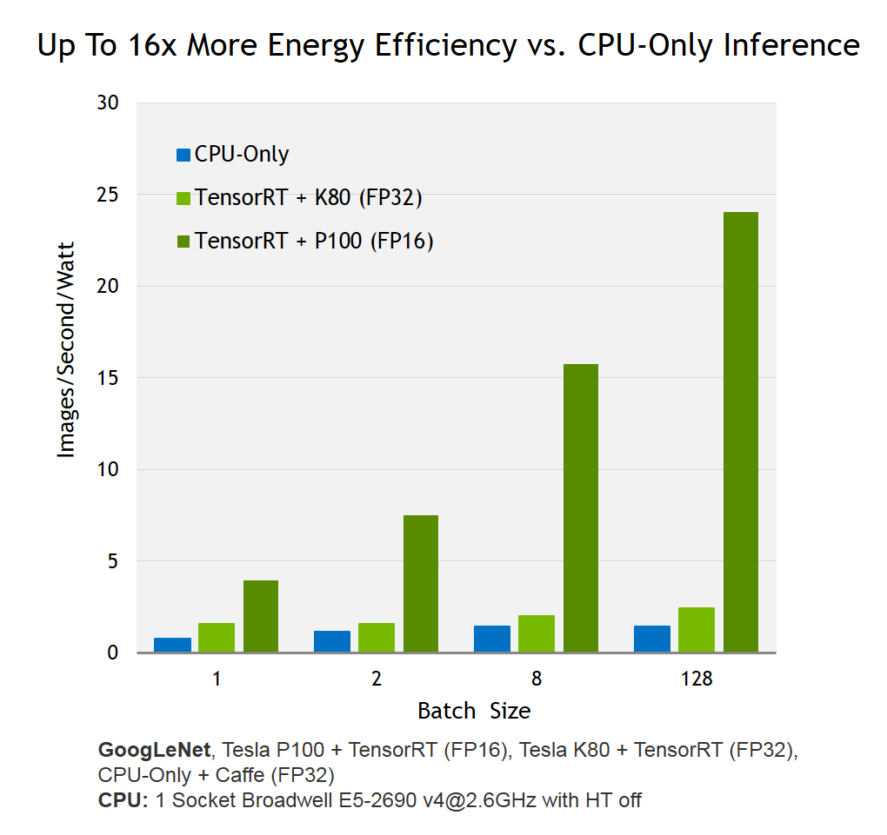
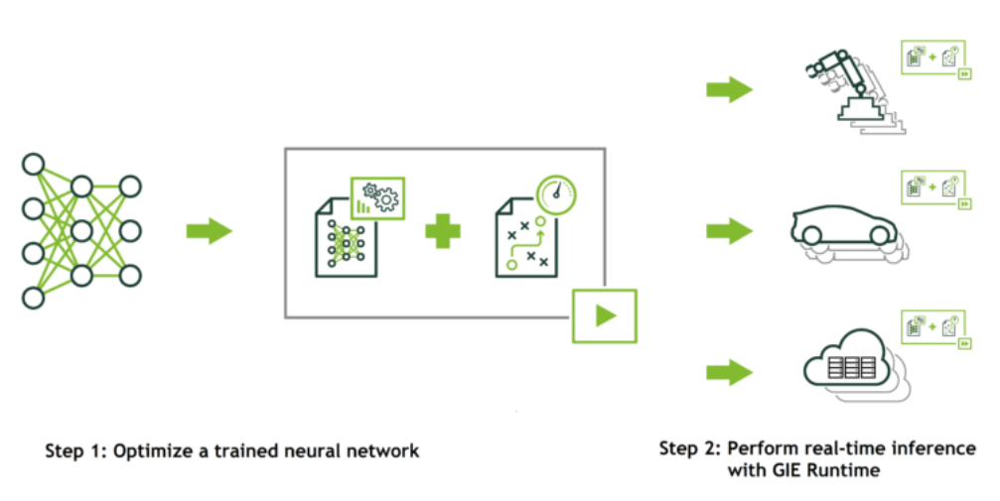
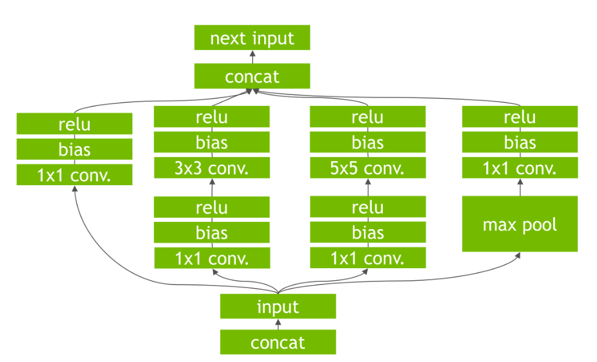
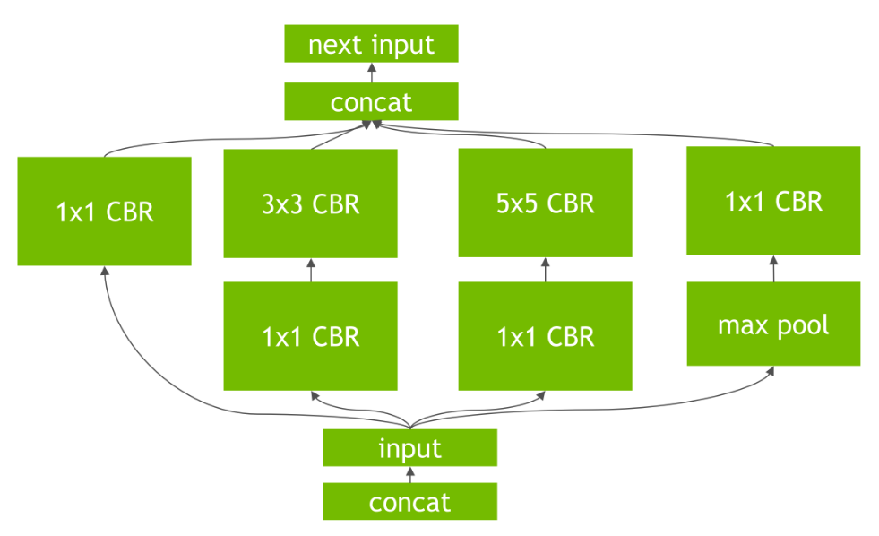
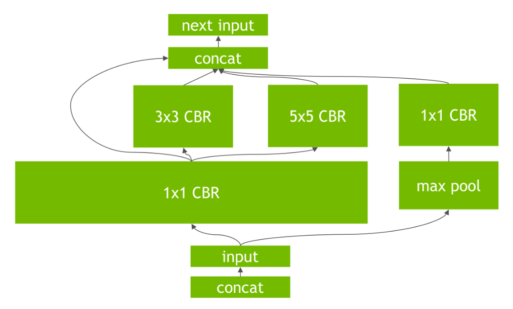

===========================
NVIDIA TensorFlow Overview
===========================

:Author: Shanyun Gao

:abstract:
        This note serves as an overview of NVIDIA TensorRT library. 
        The basic work flow, requirements and constraints of TensorRT will be 
        introduced.

.. meta:: 
        :keywords: NVIDIA, inference, deep learning

.. contents:: Table of Contents
.. section-numbering::

Introduction
============

What is TensorRT
----------------

NVIDIA TensorRT is a high-performance deep learning inference library for production 
environments. 

What is TensorRT Optimizing
---------------------------

- Power efficiency

    TensorRT optimized trained neural networks for runtime performance, delivering up to 16x higher energy efficienty on a Tesla P100 compared to CPU-only inference. The figure is shown below.

.. Note:: TensorRT is said to be able to leverage high speed reduced precision capabilities of **Pascal** GPUs as an optional optimization. However, K80 is of **Kepler** architecture while P100 is of **Pascal** architecture. Hence there is not significant performance improvement compared to CPU-only inference system, and the performance boost from P100 is obvious.

- Speed of response, i.e. performance per watt

    For some applications, such as autonomous driving, inference is done in real time. Therefore, high throughput is critical.

.. figure:: images/TensorRT2.png
    :scale: 25 %
    :alt: image

Target Users of TensrRT
-----------------------

- For common deep learning applications such as image, classification, segmentation and object detection, it delivers maximum throughput and efficiency.
- Optimize for run-time performance for web / mobile, embedded and automotive applications.

Workflow
========

There are two phases in the use of TensorRT: **build** and **deployment**.

Key Concepts
------------

Network definition
~~~~~~~~~~~~~~~~~~

A network definition consists of a *sequence of layers* and a set of *tensors*.

Layer
~~~~~

Each layer computes a set of output tensors from a set of input tensors. Layers have parameters: *convolution size stride*, *convolution filter weights* etc.

Tensor
~~~~~~

A tensor is either an *input to the network* or an *output of a layer*. 

        Tensors have a data-type specifying their precision, e.g. 16-bits floats, and three dimensions for example, channels, width and height. 

.. Note:: Each layer and tensor has a name, which is useful when profiling or reading TensorRT's build log. When using NvCaffeParser, tensor and layer names are taken from the Caffe prototxt file.

TensorRT Build Phase
--------------------

Term : PLAN
        The PLAN is an optimized object code that can be serialized and stored in memory or on disk.

In **build phase**, TensorRT generates an optimized *PLAN* for computing the forward pass through the deep neural network, by performing optimization on the network configuration. 

Requirements during Build Phase
~~~~~~~~~~~~~~~~~~~~~~~~~~~~~~~

- Three files

        1. A network architecture file (deploy.prototxt)
        2. Trained weights (net.caffemodel)
        3. A label file to provide name for each output class

- **Batch size** and **output layer** need to be defined

Important Transformations and Optimizations
~~~~~~~~~~~~~~~~~~~~~~~~~~~~~~~~~~~~~~~~~~~

    
- Layers with unused output are eliminated to avoid unnecessary computation.

- Convolution, Bias and ReLU layers are fused to a single layer, which is labeled as CBR.

- Horizontal layer fusion, or layer aggregation. 

        The transformation improves performance by combining layers that take the same source tensor and apply the same operations with similar parameters, resulting in a single layer for higher computational efficienty.

Deploy Phase
------------

- An inference engine runtime object will be returned from build phase. This runtime object is ready for immediate use.

- Alternatively, its state can be serialized and saved to disk or to an object store for distribution.
