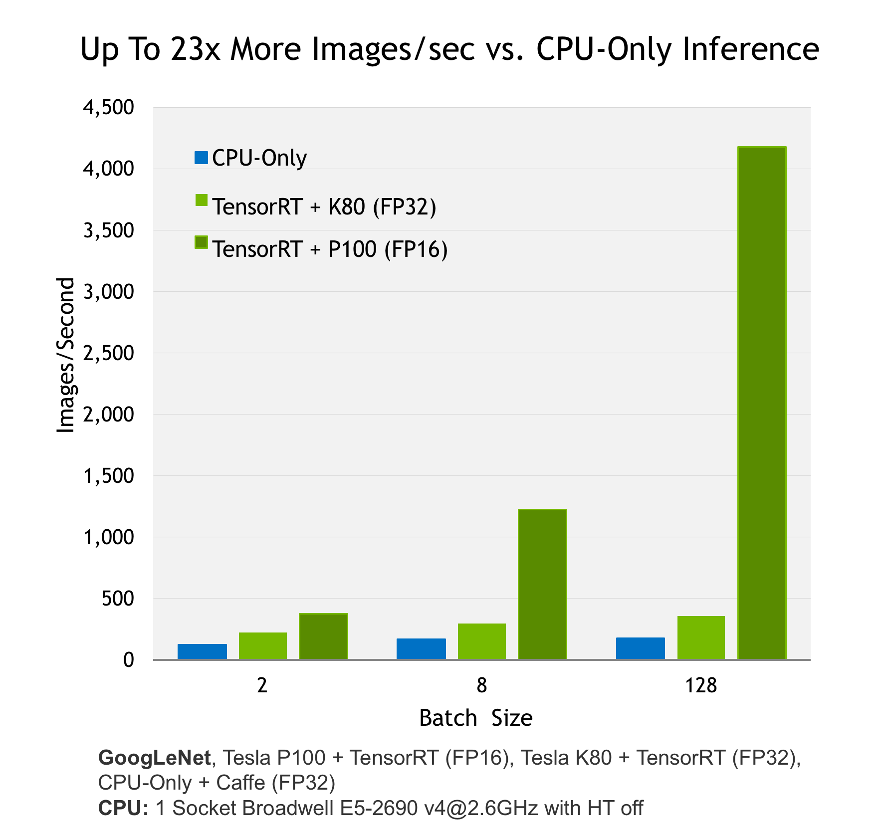

===========================
NVIDIA TensorFlow Overview
===========================

:Author: Shanyun Gao

:abstract:
        This note serves as an overview of NVIDIA TensorRT library. 
        The basic work flow, requirements and constraints of TensorRT will be 
        introduced.

.. meta:: 
        :keywords: NVIDIA, inference, deep learning

.. contents:: Table of Contents
.. section-numbering::

Introduction
============

What is TensorRT
----------------

NVIDIA TensorRT is a high-performance deep learning inference library for production 
environments. 

What is TensorRT Optimizing
---------------------------

- Power efficiency

    TensorRT optimized trained neural networks for runtime performance, delivering up to 16x higher energy efficienty on a Tesla P100 compared to CPU-only inference. The figure is shown below.

.. Note:: TensorRT is said to be able to leverage high speed reduced precision capabilities of **Pascal** GPUs as an optional optimization. However, K80 is of **Kepler** architecture which is the reason there is not much significant improving performance compared to CPU-only inference system.

- Speed of response, i.e. performance per watt

    For some applications, such as autonomous driving, inference is done in real time. Therefore, high throughput is critical.

